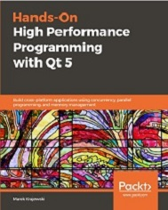

# Hands-On High Performance Programming with Qt 5

<a href="https://www.packtpub.com/application-development/hands-high-performance-programming-qt-5?utm_source=github&utm_medium=repository&utm_campaign=9781789531244 "></a>

This is the code repository for [Hands-On High Performance Programming with Qt 5](https://www.packtpub.com/application-development/hands-high-performance-programming-qt-5?utm_source=github&utm_medium=repository&utm_campaign=9781789531244 ), published by Packt.

**Build cross-platform applications using concurrency, parallel programming, and memory management**

## What is this book about?
Efficient code achieved through performance tuning is one of the key challenges faced by many programmers. This book looks at Qt programming from a performance perspective. We will look at the performance problems encountered when using the Qt platforms and means and ways to nullify it and optimize performance.

This book covers the following exciting features:
 - Understand of classic performance wisdom 
 - Get to grips with modern HW architectures and their performance impact 
 - To implement tools and procedures used in performance optimization 
 - Grasp Qt-specific work techniques for GUI and platform programming 
 - Performant usage of TCP and HTTP and the relevant Qt classes 
 - Learn about improvements Qt 5.9 (and later) has in store for us 
 - Plan of Qt’s architecture, strengths and weaknesses of graphics engines 

If you feel this book is for you, get your [copy](https://www.amazon.com/dp/1789531241) today!

<a href="https://www.packtpub.com/?utm_source=github&utm_medium=banner&utm_campaign=GitHubBanner"></a>

## Instructions and Navigations
All of the code is organized into folders. For example, Chapter02.

The code will look like the following:
```
QSignalSpy spy(tstPushBtn, SIGNAL(clicked()));  QTest::mouseClick(tstPushBtn, Qt::LeftButton);
QCOMPARE(spy.count(), 1);
```

**Following is what you need for this book:**
This book is designed for Qt developers with some knowledge of C++, who want to build highly performant applications for desktop and embedded devices.

With the following software and hardware list you can run all code files present in the book (Chapter 1-11).
### Software and Hardware List
| Chapter | Software required | OS required |
| -------- | ------------------------------------ | ----------------------------------- |
| 2-11 | Qt 5.9 MingW 32 bit Windows distribution | Windows 10 |

We also provide a PDF file that has color images of the screenshots/diagrams used in this book. [Click here to download it](https://www.packtpub.com/sites/default/files/downloads/9781789531244_ColorImages.pdf?).

### Related products
* Qt5 Python GUI Programming Cookbook [[Packt]](https://www.packtpub.com/application-development/qt5-python-gui-programming-cookbook?utm_source=github&utm_medium=repository&utm_campaign=9781788831000 ) [[Amazon]](https://www.amazon.com/dp/1788831004)

* Mastering Qt 5 - Second Edition [[Packt]](https://www.packtpub.com/web-development/mastering-qt-5-second-edition?utm_source=github&utm_medium=repository&utm_campaign=9781788995399 ) [[Amazon]](https://www.amazon.com/dp/1786467127)

## Get to Know the Author
**Marek Krajewski**
 has been programming in C++ since the mid 90s, and in Qt since 2008. In his career, he has been involved with Unix and Windows system programming, client-server systems, UMTS network management, Enterprise Java, satellite protocol decoding, neural networks, image processing, DVB-T testing appliances, REST APIs, and embedded Linux. He holds a Ph.D. in computer science and is currently working as an independent programmer specializing in Qt, C++, GUIs, system programming, and communication protocols. His other interests are off-piste skiing and Aikido, where he holds the rank of second dan.


### Suggestions and Feedback
[Click here](https://docs.google.com/forms/d/e/1FAIpQLSdy7dATC6QmEL81FIUuymZ0Wy9vH1jHkvpY57OiMeKGqib_Ow/viewform) if you have any feedback or suggestions.


